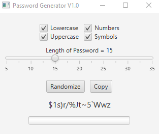

# password-generator
A JavaFX application that has many options to create the perfect password you desire!

# Level:
Capstone

# Learned:
- The fundamentals of JavaFX
- How to use SceneBuilder to help create JavaFX UI's
- How to use the MVC pattern properly
- How to interact and set the contents of the system clipboard
- Handling events from a UI application
- Using enums
- Refactoring code
- Picking from the set of ASCII characters using conditional statements
- Working with the StringBuilder object
- Working with multiple ArrayLists
- Error checking and validation
- Proper use of the final keyword

# Example output

